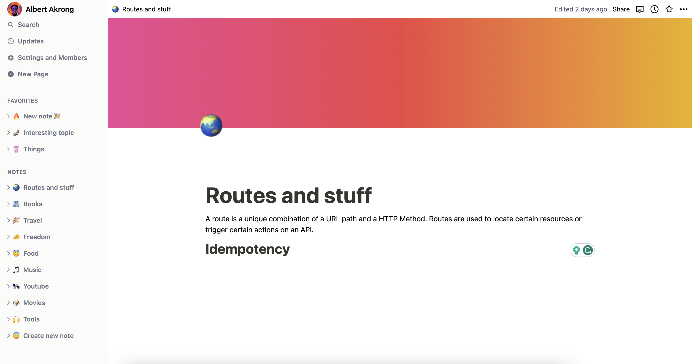

<p align="center">
  
</p>

An attempt to build a clone of notion with react, nodejs and sqlite.

Currently, it's just a work in progress.

## How to run

```bash
# Clone this repository
$ git clone <repo-url>
```

```bash
# Go into the repository
$ cd note-taking-app
```

```bash
# Install dependencies
$ npm install
```

```bash
# Run the app
$ npm dev
```
